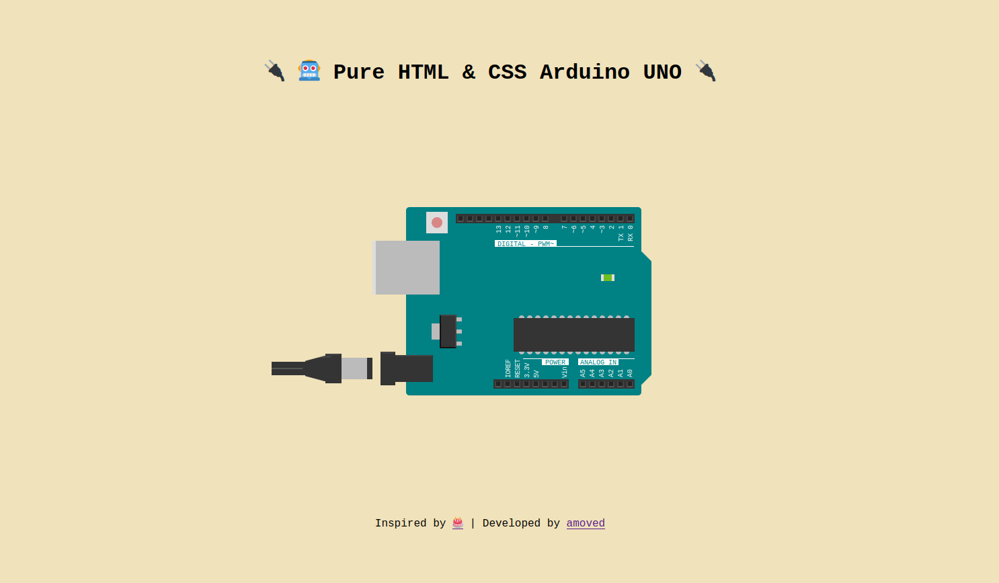

# 🔌 🤖 Pure HTML & CSS Arduino UNO 🔌

> Inspired by [Pure CSS Cake](https://pure-css-cake.vercel.app/), I have created this Arduino UNO in plain **HTML** and **CSS**. Enjoy 🎉



## Live Demo
👾 https://amoved.es/pure-html-and-css-arduino 👾

---

## Project setup
```
It's plain html and css... just open the file in your browser or upload it to your server
```


